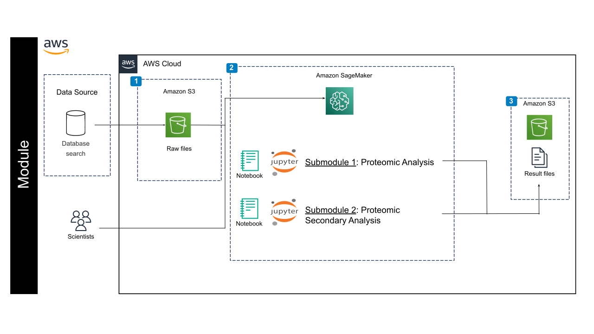

# Proteomics Training Tutorial for AWS

## Contents

+ [Module Overview](#moduleoverview)
+ [Basic Steps](#basicsteps)
+ [Getting Started](#getting-started)
+ [Architecture Design](#architecture-design)
+ [Data](#data)

## Module Overview

This module is broken up into two submodules:

+ Proteomic Analysis: Demonstrates a proteomics data analysis workflow using R, focusing on quality control, normalization, and differential abundance analysis. It covers steps from initial data processing and normalization to linear modeling and statistical testing, including handling missing values and batch effects. The notebook provides explanations of key concepts and visualizations like boxplots, PCA, and MD plots for result interpretation.
+ Proteomic Secondary Analysis: Provides a standard operating procedure for analyzing proteomics data, focusing on TMT and DIA experiments. It outlines steps from database searching and quality control using proteiNorm for normalization to differential abundance analysis using limma in R, including code examples and explanations of key terms and methods.

## Basic Steps 

1. Database search using Mascot, MaxQuant, or Prosit/EncylopeDIA. The example TMT data was searched using MS3 in MaxQuant. 
2. Assess the sample variance, biological replicate correlation, and data distributions using ProtieNorm (Graw et al 2021). 
3. Perform data normalization using the method with the lowest variance and highest intra-group correlation. For the majority of cases, VSN and Cyclic Loess have performed well. 
4. Plot quality control figures such as PCA and clustered dendrograms to check for outlier samples. These plots will give an indication of the effect size in the data. How many proteins do we expect to be differentially expressed? 
5. Set up the limma model and run analysis. The model should consider factors such as batch, sex, age, if the samples are paired, etc. 
6. Plot the results using Volcano and/or MD plots. 

## Getting Started 

**1)** Follow the steps highlighted [here](https://github.com/NIGMS/NIGMS-Sandbox/blob/main/docs/HowToCreateAWSSagemakerNotebooks.md) to create a new notebook instance in Amazon SageMaker. Follow steps and be especially careful to enable idle shutdown as highlighted. For this module, in [step 4](https://github.com/NIGMS/NIGMS-Sandbox/blob/main/docs/HowToCreateAWSSagemakerNotebooks.md) in the "Notebook instance type" tab, select ml.m5.xlarge from the dropdown box. Select R kernel in [step 8](https://github.com/NIGMS/NIGMS-Sandbox/blob/main/docs/HowToCreateAWSSagemakerNotebooks.md).

**2)** You will need to download the tutorial files from GitHub. The easiest way to do this would be to clone the repository from NIGMS into your Amazon SageMaker notebook. To clone this repository, use the Git symbol on left menu and then insert the link `https://github.com/NIGMS/Proteome-Quantification.git` as it illustrated in [step 7](https://github.com/NIGMS/NIGMS-Sandbox/blob/main/docs/HowToCreateAWSSagemakerNotebooks.md). Please make sure you only enter the link for the repository that you want to clone. There are other bioinformatics related learning modules available in the [NIGMS Repository](https://github.com/NIGMS). This will download our tutorial files into a folder called `Proteome-Quantification`.

**IMPORTANT NOTE** 

Make sure that after you are done with the module, close the tab that appeared when you clicked **OPEN JUPYTERLAB**, then check the box next to the name of the notebook you created in [step 3](https://github.com/NIGMS/NIGMS-Sandbox/blob/main/docs/HowToCreateAWSSagemakerNotebooks.md). Then click on **STOP** at the top of the Workbench menu. Wait and make sure that the icon next to your notebook is grayed out.

## Architecture Design

You will use a database search to locate raw files, which are then stored in Amazon S3. These files are then processed within the AWS Cloud's SageMaker ecosystem using an Amazon SageMaker Notebook. Two Jupyter notebooks execute proteomic analysis submodules: one for primary analysis and another for secondary analysis.  The results of these analyses are then outputted as result files.

## Data 

These Jupyter Notebooks use Tandem Mass Tag (TMT) multiplex proteomics data, derived from a mass spectrometry experiment. Specifically, they use:

+ **MS3 Reporter Ion Intensities**: The core data is the raw MS3 reporter ion intensities, representing protein abundance. This is loaded from a CSV file named `proteoDA_MS3_input.csv`. It also contains protein annotation data, alongside the intensity values. This helps identify the proteins corresponding to the measured intensities.

+ **Sample Metadata**: Information about each sample, including experimental group, batch, and other covariates (like age, sex, etc.) is provided in another CSV file called `proteoDA_sample_metafile.csv`. This file links the intensities to experimental conditions.
