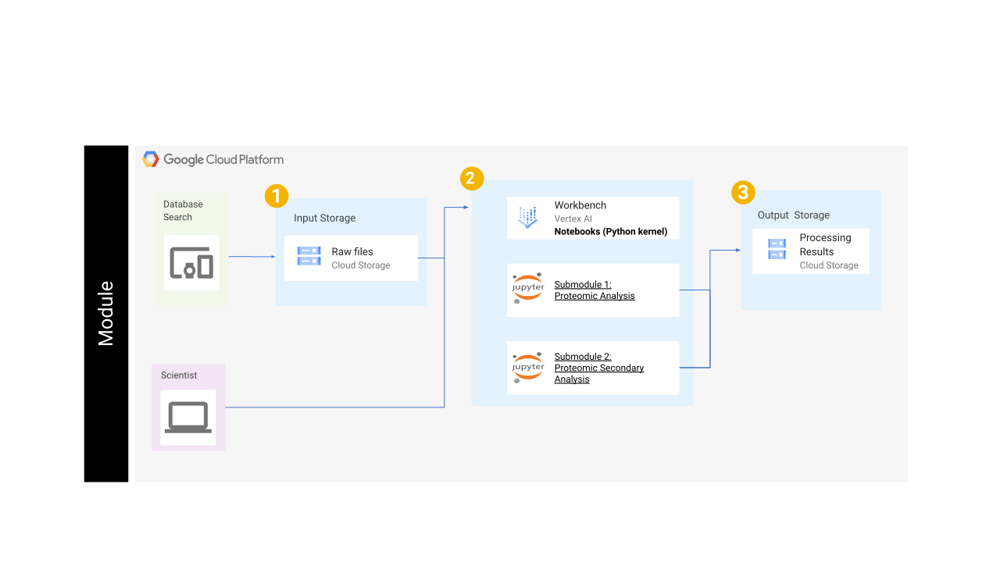

# Proteomics Training Tutorial for Google Cloud

## Contents

+ [Module Overview](#moduleoverview)
+ [Basic Steps](#basicsteps)
+ [Getting Started](#getting-started)
+ [Architecture Design](#architecture-design)
+ [Data](#data)

## Module Overview

This module is broken up into two submodules:

+ Proteomic Analysis: Demonstrates a proteomics data analysis workflow using R, focusing on quality control, normalization, and differential abundance analysis. It covers steps from initial data processing and normalization to linear modeling and statistical testing, including handling missing values and batch effects. The notebook provides explanations of key concepts and visualizations like boxplots, PCA, and MD plots for result interpretation.
+ Proteomic Secondary Analysis: Provides a standard operating procedure for analyzing proteomics data, focusing on TMT and DIA experiments. It outlines steps from database searching and quality control using proteiNorm for normalization to differential abundance analysis using limma in R, including code examples and explanations of key terms and methods.

## Basic Steps 

1. Database search using Mascot, MaxQuant, or Prosit/EncylopeDIA. The example TMT data was searched using MS3 in MaxQuant. 
2. Assess the sample variance, biological replicate correlation, and data distributions using ProtieNorm (Graw et al 2021). 
3. Perform data normalization using the method with the lowest variance and highest intra-group correlation. For the majority of cases, VSN and Cyclic Loess have performed well. 
4. Plot quality control figures such as PCA and clustered dendrograms to check for outlier samples. These plots will give an indication of the effect size in the data. How many proteins do we expect to be differentially expressed? 
5. Set up the limma model and run analysis. The model should consider factors such as batch, sex, age, if the samples are paired, etc. 
6. Plot the results using Volcano and/or MD plots. 

## Getting Started 

Follow the steps highlighted [here](https://github.com/NIGMS/NIGMS-Sandbox/blob/main/docs/HowToCreateVertexAINotebooks.md) to create a notebook Instance in Vertex AI. Follow steps 1-8 and be especially careful to **enable idle shutdown** as highlighted in step 8. In step 7 in the Machine type tab, select **n1-standard-4** from the dropdown box.

To clone this repository, [open a Terminal window](https://github.com/NIGMS/NIGMS-Sandbox/blob/main/docs/HowToCreateNewTerminalConsoleJupyterLab.md) in your new instance and type `git clone https://github.com/NIGMS/Proteome-Quantification/GoogleCloud.git` This will create a directory called Proteome-Quantification. Navigate into that directory and open the tutorial notebooks to get started.

## Architecture Design

You will use a database search to retrieve raw files, which are stored in Google Cloud Storage (1). These files are then processed using Jupyter Notebooks with a Python kernel on Vertex AI Workbench (2). The workbench runs two proteomic analysis submodules. The processing results are then stored back into Cloud Storage (3).

## Data 

These Jupyter Notebooks use Tandem Mass Tag (TMT) multiplex proteomics data, derived from a mass spectrometry experiment. Specifically, they use:

+ **MS3 Reporter Ion Intensities**: The core data is the raw MS3 reporter ion intensities, representing protein abundance. This is loaded from a CSV file named `proteoDA_MS3_input.csv`. It also contains protein annotation data, alongside the intensity values. This helps identify the proteins corresponding to the measured intensities.

+ **Sample Metadata**: Information about each sample, including experimental group, batch, and other covariates (like age, sex, etc.) is provided in another CSV file called `proteoDA_sample_metafile.csv`. This file links the intensities to experimental conditions.
