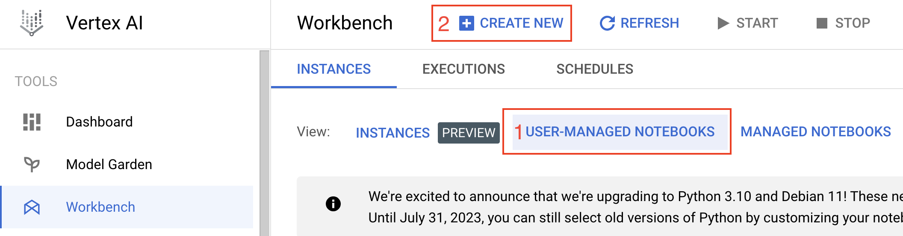
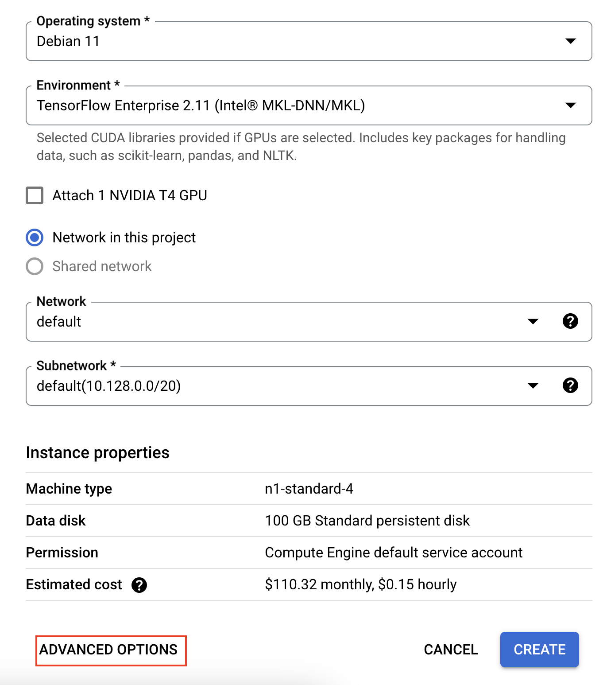
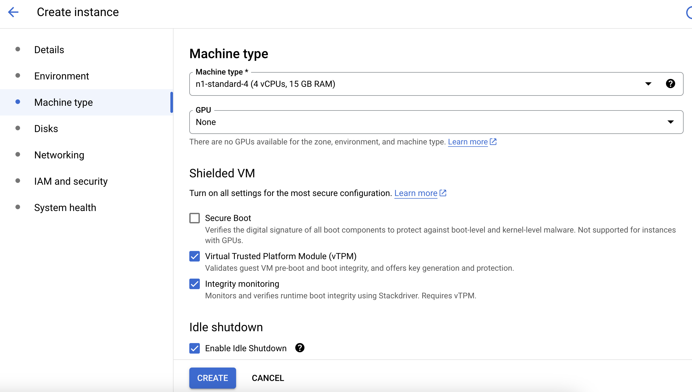

Image adapted from https://doi.org/10.1038/nature01511

# Google Cloud Proteomics Training Tutorial

## Proteomics Data Analysis Overview

This notebook outlines the essential steps in the process of analyzing proteomics data and recommends commonly used tools and techniques for this purpose. It assumes a simple experimental design for differential abundance including two experimental conditions such as cancer vs normal. The training data provided utilized TMT10plex multiplex design with MS3 data acquistion. This notebook describes mass spectrometry and statistical terminology for data preprocessing, normalization, and differential abundance analysis. Note: This notebook uses simple base R plots. These can be modified to learn how to build better publication quality plots using R. 

## Table of Contents

+ [Requirements](#requirements)
+ [Getting Started](#getting-started)
+ [Funding](#funding)
   

## Requirements

This tutorial was designed to be used on cloud computing platforms, with the aim of requiring nothing but the files within this github repository.
The Jupyter Notebook file can run on Google Cloud Platform, Amazon Web Service, and Microsoft Azure provided the R packages are installed. The Notebook can be launched using NIH STRIDES training module and therfore requirements should only require access NIH STRIDES resources.

## **License for Data**

Text and materials are licensed under a Creative Commons CC-BY-NC-SA license. The license allows you to copy, remix and redistribute any of our publicly available materials, under the condition that you attribute the work (details in the license) and do not make profits from it. More information is available [here](https://tilburgsciencehub.com/about/#license).

This work is licensed under a [Creative Commons Attribution-NonCommercial-ShareAlike 4.0 International License](http://creativecommons.org/licenses/by-nc-sa/4.0/)

This tutorial will cost you just less than $1.00 assuming a n1-standard-4 machine, and assuming you delete the virtual machine after you finish the tutorial.

## Getting Started

In your Vertex AI Workbench, click **Create New**. Make sure User-Managed Notebooks is highlighted, as shown in the screenshot below. 

In the new instance window, scroll down and select **Advanced Options**

In the Environment tab, select Debian 10 and R 4.2 as the operating system and environment. Make sure to click the **Enable Idle Shutdown** button in the Machine type tab as shown in the screenshot below. Finally, select the appropriate hardware in the Machine type tab. n1-standard-4 is sufficient for this module.

### Basic Steps 

1. Database search using Mascot, MaxQuant, or Prosit/EncylopeDIA. The example TMT data was searched using MS3 in MaxQuant. 
2. Assess the sample variance, biological replicate correlation, and data distributions using ProtieNorm (Graw et al 2021). 
3. Perfom data normalization using the method with the lowest variance and highest intra-group correlation. For the majority of cases, VSN and Cyclic Loess have performed well. 
4. Plot quality control figures such as PCA and clustered dendrograms to check for outlier samples. These plots will give an indication of the effect size in the data. How many proteins do we expect to be differenitally expressed? 
5. Set up the limma model and run analysis. The model should consider factors such as batch, sex, age, if the samples are paired, etc. 
6. Plot the results using Volcano and/or MD plots. 

## Funding

Funded by National Resource for Quantitative Proteomics NIH/NIGHMS R24GM137786.
