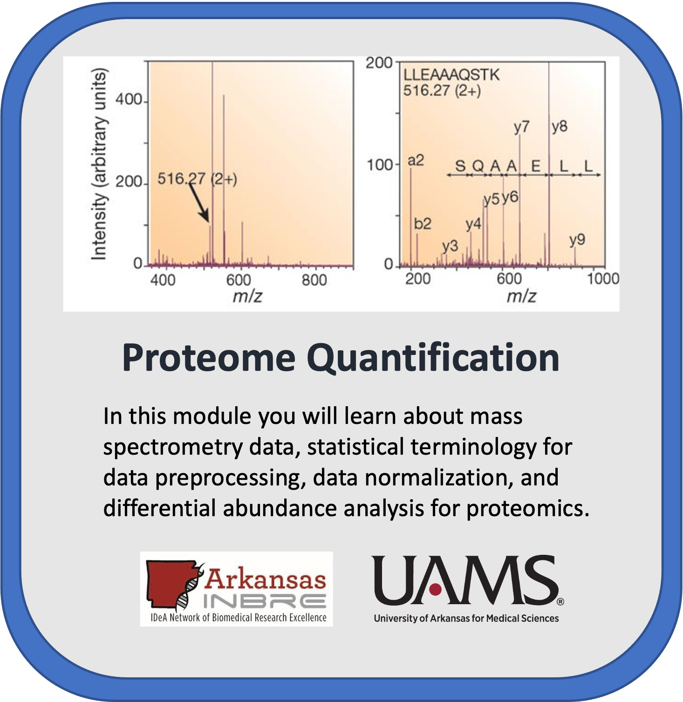

Image adapted from https://doi.org/10.1038/nature01511

# AWS Proteomics Training Tutorial

## Proteomics Data Analysis Overview

This notebook outlines the essential steps in the process of analyzing proteomics data and recommends commonly used tools and techniques for this purpose. It assumes a simple experimental design for differential abundance including two experimental conditions such as cancer vs normal. The training data provided utilized TMT10plex multiplex design with MS3 data acquisition. This notebook describes mass spectrometry and statistical terminology for data preprocessing, normalization, and differential abundance analysis. Note: This notebook uses simple base R plots. These can be modified to learn how to build better publication quality plots using R. 

## Table of Contents

+ [Requirements](#requirements)
+ [Getting Started](#getting-started)
+ [Funding](#funding)
   

## Requirements

This tutorial was designed to be used on cloud computing platforms, with the aim of requiring nothing but the files within this github repository.
The Jupyter Notebook file can run on Google Cloud Platform, Amazon Web Service, and Microsoft Azure provided the R packages are installed. The Notebook can be launched using NIH STRIDES training module and therefore requirements should only require access NIH STRIDES resources.

## **License for Data**

Text and materials are licensed under a Creative Commons CC-BY-NC-SA license. The license allows you to copy, remix and redistribute any of our publicly available materials, under the condition that you attribute the work (details in the license) and do not make profits from it. More information is available [here](https://tilburgsciencehub.com/about/#license).

This work is licensed under a [Creative Commons Attribution-NonCommercial-ShareAlike 4.0 International License](http://creativecommons.org/licenses/by-nc-sa/4.0/)

This tutorial will cost you just less than $1.00 assuming a t3.medium machine, and assuming you delete the virtual machine after you finish the tutorial.

## Getting Started

### *Creating a user managed notebook in AWS* 

Follow the steps highlighted [here](/create_aws_notebook/AWS_Notebook.md) to create a new user-managed notebook in SageMaker. In step 4 for the Notebook instance type tab, select **ml.m5.xlarge** from the dropdown box. In step 8, select **R** kernel. It is **important to stop** the kernel at the end (step 9) to aviod getting charged. 

### *Creating a user managed notebook in GCP* 

Follow the steps highlighted [here](https://github.com/STRIDES/NIHCloudLabGCP/blob/main/docs/vertexai.md) to create a new user-managed notebook in Vertex AI. Follow steps 1-8 and be especially careful to **enable idle shutdown** as highlighted in step 7. For this module you should select **Debian 10 and R 4.2** in the Environment tab in step 5. In step 6 in the Machine type tab, select **n1-standard-4** from the dropdown box.

To clone this repository, open a Terminal window in your new instance and type `git clone https://github.com/NIGMS/Proteome-Quantification.git` This will create a directory called Proteome-Quantification. Navigate into that directory and open the tutorial notebooks to get started.

### Basic Steps 

1. Database search using Mascot, MaxQuant, or Prosit/EncylopeDIA. The example TMT data was searched using MS3 in MaxQuant. 
2. Assess the sample variance, biological replicate correlation, and data distributions using ProtieNorm (Graw et al 2021). 
3. Perform data normalization using the method with the lowest variance and highest intra-group correlation. For the majority of cases, VSN and Cyclic Loess have performed well. 
4. Plot quality control figures such as PCA and clustered dendrograms to check for outlier samples. These plots will give an indication of the effect size in the data. How many proteins do we expect to be differentially expressed? 
5. Set up the limma model and run analysis. The model should consider factors such as batch, sex, age, if the samples are paired, etc. 
6. Plot the results using Volcano and/or MD plots. 

## Funding

Funded by National Resource for Quantitative Proteomics NIH/NIGHMS R24GM137786.
